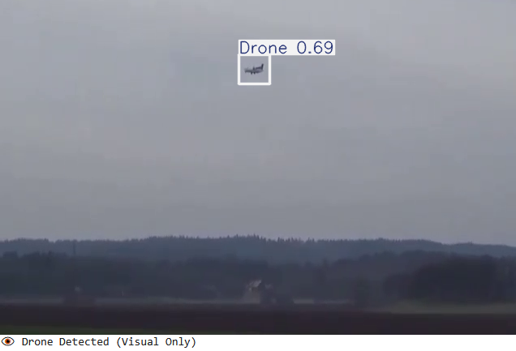
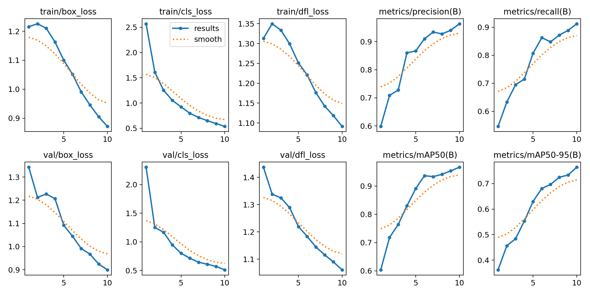
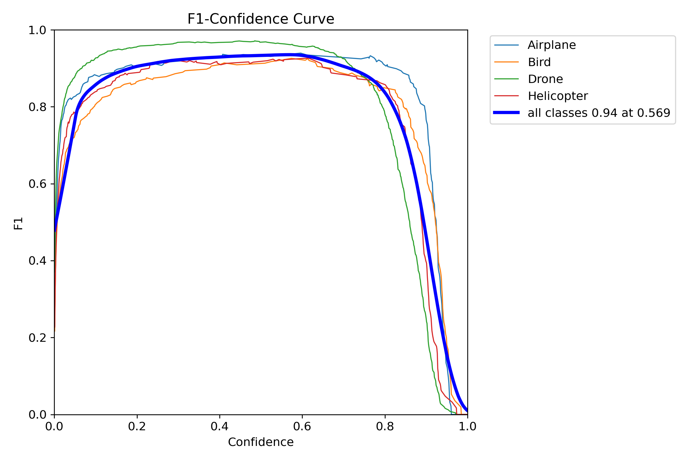

# Drone Detection System Using AI Via Audio And Video

## Description

This project presents a complete AI-based drone detection system that combines both audio and visual analysis. It leverages a custom-trained 1D Convolutional Neural Network (CNN1D) for detecting drone sounds from audio recordings, achieving an accuracy of up to 98%. For visual detection, a YOLOv8 model was trained to recognize drones in video frames with high confidence.

The system is capable of:
- Extracting audio from video files and classifying it as drone or non-drone.
- Analyzing each video frame to visually detect drones using real-time object detection.
- Combining both audio and visual results to confirm drone presence with greater reliability.

This project demonstrates how deep learning can be applied in real-world security and surveillance scenarios. It also includes a Streamlit-based user interface for interactive testing and result visualization.

## Output

## Model results

## 🛠️ How It Works

- The user uploads a video file.
- The system extracts audio and analyzes it using a CNN1D model.
- Simultaneously, YOLOv8 analyzes video frames to detect drones visually.
- If either audio or video detection is positive, a warning is triggered.
- Results are displayed in a user-friendly Streamlit interface.

## 🚀 Project Structure

drone_detection_project/
├── models/
│ ├── drone_audio_model.h5
│ └── drone_YOLO_model.pt
├── drone_audio_detection_cnn.ipynb
├── drone_image_detection_YOLO.ipynb
├── app.py
├── requirements.txt
└── README.md

## 💻 Technologies Used

- Python 3.10

- TensorFlow (CNN1D)

- YOLOv8 (Ultralytics)

- OpenCV

- Librosa

- MoviePy

- Streamlit

